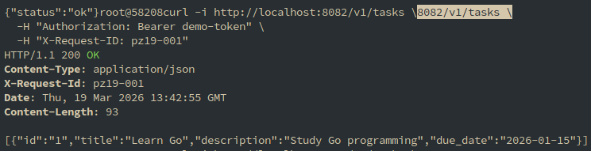

# Практическое занятие №12: Сравнение REST и GraphQL на одном функционале

## 📋 Описание

В рамках практической работы реализован один и тот же сценарий для сущности **Task** двумя способами:
- **REST API** (традиционный подход)
- **GraphQL API** (современный подход)

Сравнение проводится по следующим критериям:
- структура API
- выбор полей и избыточность данных (over‑fetching)
- обработка ошибок
- количество запросов
- удобство для клиента

---

## 🛠️ Используемые технологии

- **Go** 1.21+
- **REST** – стандартные HTTP-эндпоинты (сервис tasks на порту 8082)
- **GraphQL** – gqlgen (сервис на порту 8081)

Оба сервиса используют одинаковые тестовые данные и поддерживают одни и те же операции:
- получение списка задач
- получение задачи по ID
- создание задачи
- обновление признака `done`

---

## 📡 REST API (порт 8082)

### 1. Получение списка задач (все поля)



```bash
curl -i http://localhost:8082/v1/tasks \
  -H "Authorization: Bearer demo-token" \
  -H "X-Request-ID: pz19-001"
